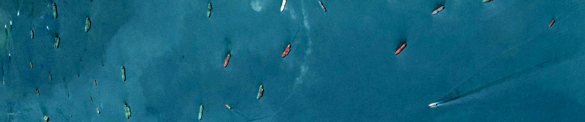

# About The Project
</img>

## Airbus Ship Detection Challenge 

In this project I will try to solve the legendary kaggle competition - <a href='https://www.kaggle.com/competitions/airbus-ship-detection'>Airbus Ship Detection Challenge</a>. This competition encourages participants to develop a model for the rapid and accurate detection of all ships in satellite images. This readme file has a description of solution.

## Data Analysis

At the beginning, I decided to explore the data and found that about 80% of the data had no ships at all, which I thought might have a negative impact on model training, so I decided to reduce the percentage of images without ships to 23%.

<p align="center">
    
</p>

Another important point is that the image masks were encoded using the RLE algorithm. Run-Length Encoding (RLE) in the context of images is a coding algorithm that represents the mask of regions on an image by recording the length of consecutive rows or columns of identical values, allowing for efficient storage and transmission of information about the shape and location of objects.

<p align="center">
    
</p>

## Architecture

For this Project I chose <b>PyTorch</b>. In my opinion, it has an advantage over others in ease of use. Next, I needed to choose a model architecture for semantic segmentation. And I chose <b>U-Net</b> architecture to solve this problem because of its efficient ability to take into account both local and global contexts in images. Due to its architecture, <b>U-Net</b> is able to detect and preserve object details, which allows for accurate and clear segmentations. also I used <b>ResNet34</b> as an encoder. In my opinion <b>ResNet34</b> has an ideal balance between speed then accuracy.

<p align="center">
    
</p>

## Loss Function

For the loss function and evaluation metrics I used <b>DiceLoss</b>. From the definition, we can see that the Dice coefficient increases the weight of the overlap in both the numerator and the denominator. This means that as the overlap increases, the Dice loss function provides a greater gradient flow, which encourages more precise segmentation.

<p align="center">
    
</p>

## Training

First of all, I want to say that I trained the model in the Notebook, so it was more convenient for me.
As optimizer I used Adam. Adam is optimal for me. Also, since I have limited computing power, I reduced the images by a factor of 3 and they were trained with a size of 256x256. But I think training will almost not change from this.
The important point is that I trained the model initially on less data and with simpler data for training and later used these weights for training on all data.

There are hyperparameters:

EPOCHS = 8<br>
BATCH_SIZE = 16<br>
LR = 0.03

I set BATCH_SIZE value as 16 because during the experiment I found out that it most efficiently uses computing resources, and also provides good accuracy.


<p align="center">
    
</p>


<p align="center">
    
</p>

## Navigate

* <b>workflow.ipynb</b> - Notebook on which all code, model tranning and results vizualization.
* <b>inference.py</b> - This file load model and visualize the result (image segmentation).
* <b>model.py</b> - PyTorch model implementation.

### Usage

* To visualize result on single image:
   ```sh
   python inference.py --image_path image_path
   ``` 


## My talk

This is a fairly typical task, but it was interesting. It was also possible to make a more complex architecture, but I think my decision is enough.